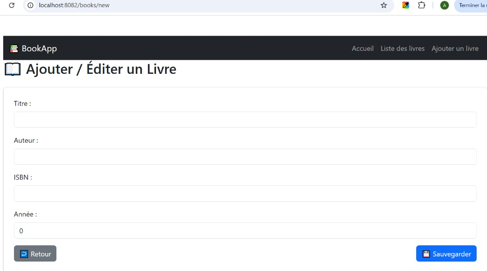
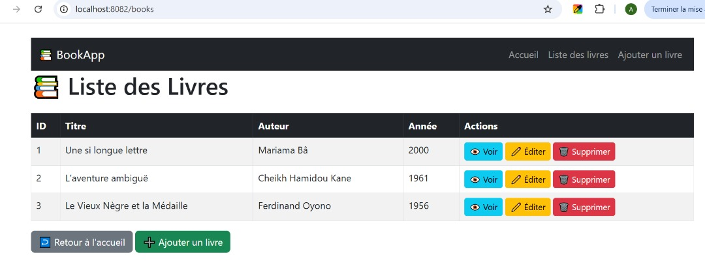

# Mini Projet Spring Boot

## Description
Ce projet est un mini projet développé avec **Spring Boot**. Il inclut les fonctionnalités principales suivantes :
- Gestion des entités `Book` (exemple)
- API REST pour les opérations CRUD
- Base de données en mémoire H2 pour le développement

## Prérequis
Avant de lancer le projet, assurez-vous d’avoir :
- **Java 17** ou supérieur installé
- **Maven** (le projet inclut Maven Wrapper, donc Maven installé n’est pas obligatoire)

## Lancement du projet

### Avec Maven Wrapper
**Windows :**

.\mvnw.cmd spring-boot:run
Linux / Mac :

./mvnw spring-boot:run
Le projet sera accessible sur : http://localhost:8082

Avec IntelliJ IDEA
Ouvrir le projet dans IntelliJ.

Cliquer droit sur la classe principale annotée @SpringBootApplication.

Sélectionner Run 'NomDeLaClassePrincipale'.

Base de données
Le projet utilise H2 Database pour le développement.

URL : http://localhost:8080/h2-console
Nom de la base : testdb
Username : sa
Password : (vide)
Structure du projet
Voici une vue d’ensemble des dossiers principaux et de leur rôle :

src/main/java
 └─ com/exercice/mini_projet
     ├─ controller/   → Gestion des endpoints REST (ex : BookController)
     ├─ service/      → Logique métier et traitement des données (ex : BookService)
     ├─ repository/   → Interfaces pour l’accès aux données (ex : BookRepository)
     └─ entity/       → Définition des entités (ex : Book)
     
src/main/resources
 ├─ application.properties → Configuration du projet (port, DB, etc.)
 └─ data.sql              → Optionnel : script d’initialisation de la DB
API REST
Le projet expose des endpoints CRUD pour la gestion des livres (Book) :

Méthode	Endpoint	Description
GET	/books	Liste de tous les livres
GET	/books/{id}	Récupérer un livre par ID
POST	/books	Créer un nouveau livre
PUT	/books/{id}	Mettre à jour un livre
DELETE	/books/{id}	Supprimer un livre

Swagger (Documentation API)
Si Swagger est activé, vous pouvez accéder à la documentation API sur :
http://localhost:8080/swagger-ui.html

Notes
Ce README est prévu pour un projet de développement local.

Pour un déploiement sur un serveur, adaptez les configurations de application.properties.

